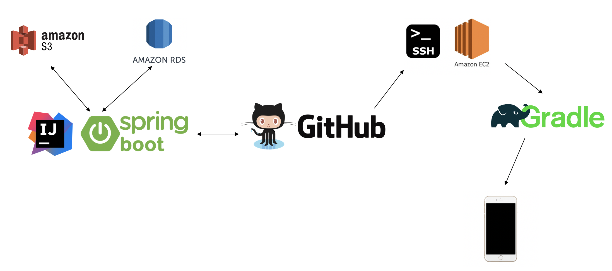

~~~
██████╗   ███████╗  ███████╗     █████╗    ████╗    ████████╗
██╔══██╗  ██╔════╝  ██╔════╝    ██╔═══╝   ██══██╗   ╚══██╔══╝
██████╔╝  █████╗    ███████    ██╗       ████████╗     ██║
██╔══██╗  ██╔══╝    ╚════██║   ╚██╗      ██╔═══██╗     ██║
██║  ██║  ███████╗  ███████║    ╚█████╗  ██║   ██║     ██║
╚═╝  ╚═╝  ╚══════╝  ╚══════╝     ╚════╝  ╚═╝   ╚═╝     ╚═╝
~~~

## INTRODUCTION

## ARCHITECTURE

## MAIN FEATURE
* ##### RESTFul API
* ##### Spring AOP
* ##### String DATA JPA
* ##### use AWS EC2, RDS, S3
* ##### encode password by BCryptPasswordEncoder
* ##### apply XSS-filter
* ##### apply SWAGGER2

## TEAM MEMBER
* ##### [권현아](https://github.com/kwonhyeona)
* ##### [백예은](https://github.com/bye0520)
* ##### [임수정](https://github.com/SujungRim)
* ##### [황유선](https://github.com/hyuseoni)
* ##### Be taught by [배다슬](https://github.com/bghgu)

## SNS
* ##### [FACEBOOK](https://www.facebook.com/iamRescat/)
* ##### [INSTAGRAM](https://www.instagram.com/iam_rescat/)
